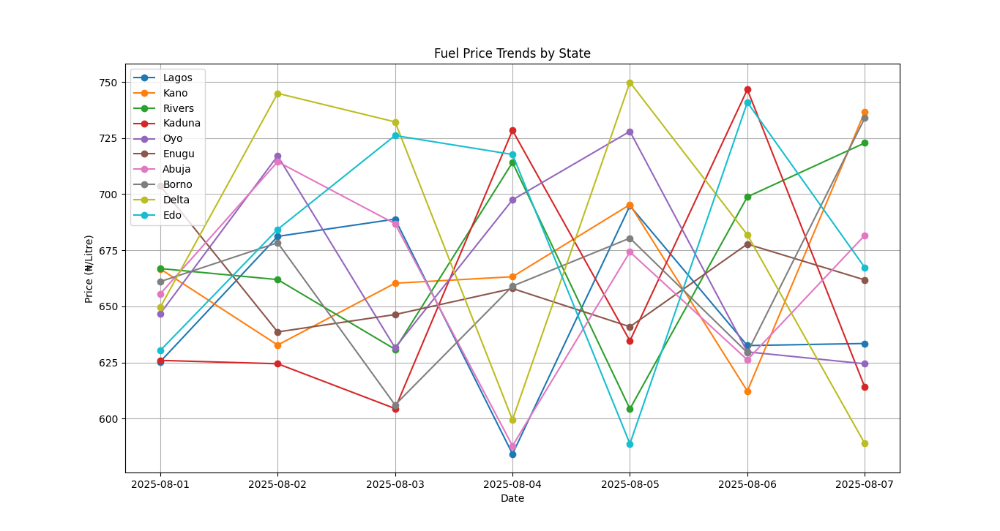

# Fuel Price Analyzer 🛢️

A Python project that analyzes and visualizes Nigerian fuel prices with Pandas, Matplotlib, and Tkinter.

## ✨ Features
- Calculate national **average fuel price**
- View **highest and lowest prices**
- Analyze prices for any **selected state**
- **Forecast** next day’s price (simple moving average)
- Detect **spikes and anomalies**
- Export **summary CSV**
- Interactive **Tkinter GUI**
- Fullscreen **Matplotlib plots**

## 📊 Example Plot


## 🚀 How to Run
1. Clone repo:
   ```bash
   git clone https://github.com/YOUR-USERNAME/fuel-price-analyzer.git
   cd fuel-price-analyzer
